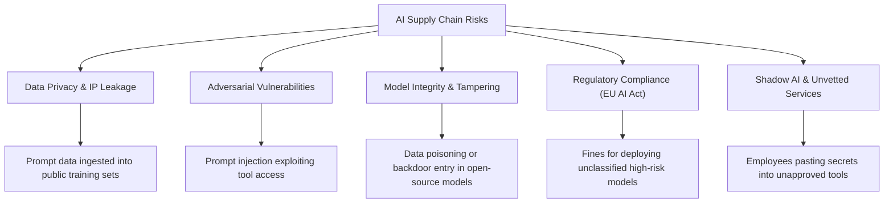

# Research Report: Third-Party Risk Management (TPRM) in the Modern AI Era

As organizations increasingly integrate third-party AI models, external LLM APIs, and autonomous agents into their core infrastructure, traditional third-party risk management (TPRM) frameworks must evolve. Below is a strategic research report outlining the major risk vectors introduced by modern AI supply chains and the cutting-edge features Cypher Vantage could implement to address them.

---

## 1. The AI Third-Party Risk Landscape

Unlike static software dependencies, third-party AI services are dynamic, non-deterministic, and highly dependent on training data, prompts, and context. This introduces five primary risk vectors:

---

## 2. Advanced Feature Recommendations for Cypher Vantage

To establish market leadership in AI-focused TPRM, Cypher Vantage can expand its portal with the following capabilities:

### 🛡️ A. LLM Data Loss Prevention (DLP) Gateway & Sanitization
* **Objective**: Prevent employees and internal systems from leaking proprietary intellectual property or PII to third-party AI hosts.
* **Feature Capability**:
  - Implement a real-time proxy API that intercepts outgoing payloads to third-party LLMs (e.g., OpenAI, Anthropic).
  - Automatically detect and redact API keys, PII (emails, SSNs), and corporate intellectual property.
  - Inject synthetic placeholder variables before routing, and map them back to the original values on response return.

### 🕵️ B. Shadow AI Discovery & Digital Footprint Mapping
* **Objective**: Uncover unvetted, shadow AI tools used within the organization.
* **Feature Capability**:
  - Integrate with corporate proxy logs, CASB (Cloud Access Security Brokers), and browser agents.
  - Automatically identify and catalog connections to unapproved AI sub-processors and web interfaces.
  - Generate a "Shadow AI Exposure Score" reflecting the volume of undocumented AI services in use.

### 🧪 C. Automated Adversarial Pentesting for Integrated Agents
* **Objective**: Verify that third-party customer-facing or internal AI agents integrated into your ecosystem cannot be compromised.
* **Feature Capability**:
  - Implement an automated simulator that submits prompt-injection payloads (e.g., jailbreaks, system-prompt extraction scripts) to third-party integrated agents.
  - Assess if the agents execute unauthorized commands or leak private configuration states.
  - Flag failures immediately in the Risk Manager's Follow-up Action Center.

### ⚖️ D. Regulatory Compliance Engines (EU AI Act & NIST AI RMF)
* **Objective**: Automate compliance audits against emerging legal standards.
* **Feature Capability**:
  - Introduce an interactive assessment mapper that classifies third-party AI models into risk categories under the **EU AI Act** (Minimal, Specific Transparency, High Risk, Prohibited).
  - Track mandatory requirements for high-risk models (e.g., human oversight, risk registers, logging).
  - Map models against the **NIST AI Risk Management Framework (AI RMF 1.0)**.

### 🔒 E. Model Integrity & Provenance Audits
* **Objective**: Validate the cryptographic safety of third-party open-source models downloaded from hubs like Hugging Face.
* **Feature Capability**:
  - Scan model binaries (e.g., `.safetensors`, `.bin`) for embedded pickle exploits or backdoors prior to loading.
  - Monitor training set lineage documentation and verify cryptographic signatures of pre-trained weights against safe model registries.

### 📉 F. Model Drift, Bias & Hallucination Evaluators
* **Objective**: Mitigate reputational liabilities arising from third-party model degradation or bias.
* **Feature Capability**:
  - Periodically query third-party decision-making APIs with standardized evaluation datasets.
  - Track metric drift (e.g., changes in accuracy, toxic outputs, or demographic parity) to alert risk assurance teams when a vendor's model updates lead to biased outcomes.
